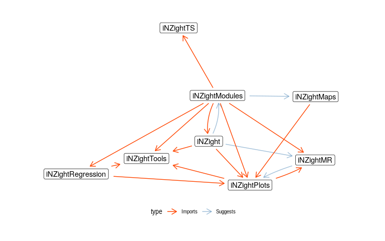

# iNZight Development Repository

This repository is where we can store all of our development scripts, files, bug lists, etc.

| package           | master                                                                                          | dev                                                                                                        | codecov                                                                                                                                                                        | cran                                                                                                                    |
|:------------------|:------------------------------------------------------------------------------------------------|:-----------------------------------------------------------------------------------------------------------|:-------------------------------------------------------------------------------------------------------------------------------------------------------------------------------|:------------------------------------------------------------------------------------------------------------------------|
| iNZight           |            |            | [](https://codecov.io/gh/iNZightVIT/iNZight?branch=master)                     | [](https://CRAN.R-project.org/package=iNZight)                     |
| iNZightPlots      |       |       | [](https://codecov.io/gh/iNZightVIT/iNZightPlots?branch=master)           | [](https://CRAN.R-project.org/package=iNZightPlots)           |
| iNZightMR         |          |          | [](https://codecov.io/gh/iNZightVIT/iNZightMR?branch=master)                 | [](https://CRAN.R-project.org/package=iNZightMR)                 |
| iNZightTools      |       |       | [](https://codecov.io/gh/iNZightVIT/iNZightTools?branch=master)           | [](https://CRAN.R-project.org/package=iNZightTools)           |
| iNZightTS         |          |          | [](https://codecov.io/gh/iNZightVIT/iNZightTS?branch=master)                 | [](https://CRAN.R-project.org/package=iNZightTS)                 |
| iNZightRegression |  |  | [](https://codecov.io/gh/iNZightVIT/iNZightRegression?branch=master) | [](https://CRAN.R-project.org/package=iNZightRegression) |
| iNZightModules    |     |     | [](https://codecov.io/gh/iNZightVIT/iNZightModules?branch=master)       | [](https://CRAN.R-project.org/package=iNZightModules)       |
| iNZightMaps       |        |        | [](https://codecov.io/gh/iNZightVIT/iNZightMaps?branch=master)             | [](https://CRAN.R-project.org/package=iNZightMaps)             |

------------------------------------------------------------------------

## To start developing iNZightVIT (assumes Linux):

1.  Create a new directory: `~/iNZight` (This must be in your home directory)

``` bash
mkdir ~/iNZight
cd ~/iNZight
```

1.  Inside `iNZight`, clone the `dev` repository (assumes git is set up):

``` bash
git clone git@github.com:iNZightVIT/dev
cd dev
```

1.  From inside the `dev` directory, build the full iNZight development directories:

``` bash
make build
cd ..
```

1.  Now, inside `~/iNZight/`, you will have all of the required directories for developing iNZight.

------------------------------------------------------------------------

## Dependency Structure

This graph shows the interaction between various iNZight R packages.



------------------------------------------------------------------------

If you have any issues with these instructions, please email `tom.elliott@auckland.ac.nz`.
